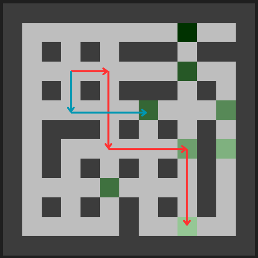
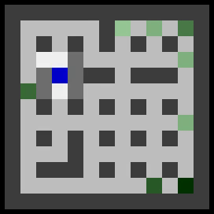
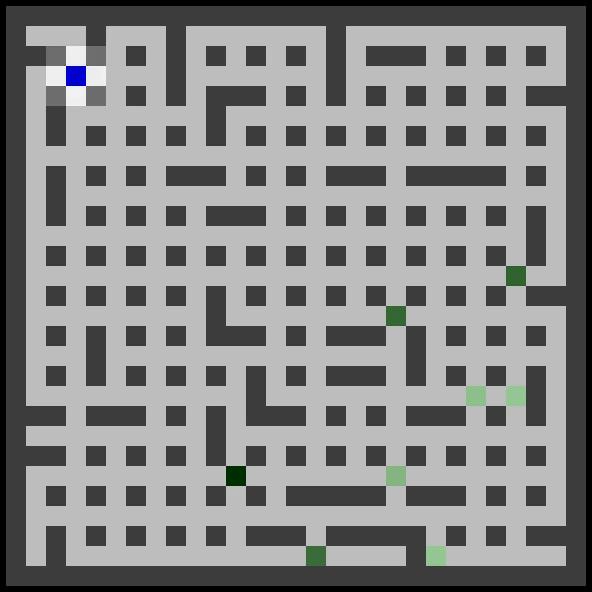
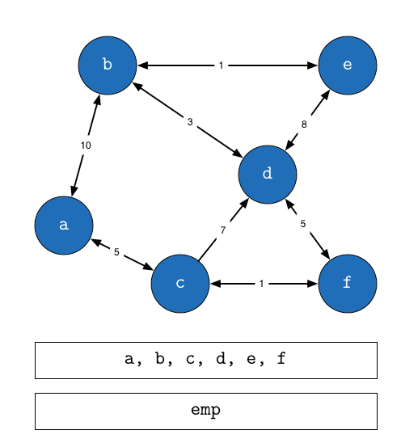
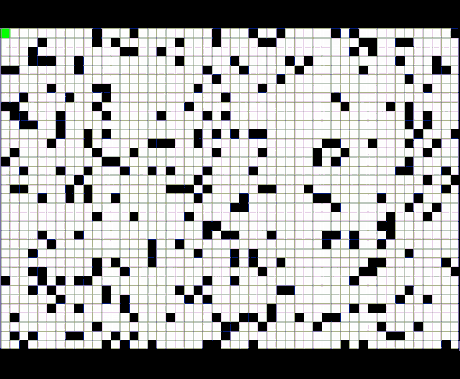
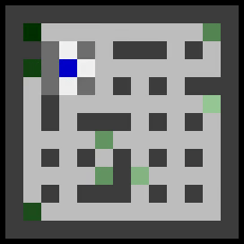
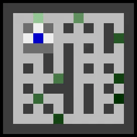

# Philippe Gratias-Quiquandon : Submission for AMazeMe
## Additional files

For the exercise, I customized some of the original files, so here is a summary of the files in the `additional_files/` folder :
* `compute_score.py` : The file I used to compute the evaluation of a method. To run it, just `python additional_files/compute_score.py`
* `custom_maze.py` : Customized maze file that returns the maze layout in order to compute the oracle.
* `oracle.py` : Given the maze layout, it finds the best gold to exploit if Wallace starts at the (3,3) cell.
* `philippe_solution.py` : My solution, it is the same file as the `solution.py` that is in the main folder.
* `solution_classic_q_learning.py` : The classical Q-learning solution that is introduced below.
* `test_oracle.py` : A test to check whether the oracle works properly.

## Evaluation
Before designing an algorithm, I wanted to clearly define what "the best solution" means. Let us define an oracle : Imagine we know the entire maze, how can we define the best solution ?
* First, we want to collect the maximum amount of gold possible
* Then, we have a limited number of steps, so we want it fast

For example, in the image below, we have a high amount of gold (in light green) but far away from the spawn point. There is also a small amount of gold (in dark green) closer to the start, which may be more valuable to collect.



Ultimately, this can be reduced to the following ratio:
```math
\text{oracle} = \max \frac{\text{gold}}{\text{shortest path to the gold from the start}}
```
If we have found this maximum ratio, we can simply exploit the trajectory to get the maximum amount of gold we could expect.

We can then define this metric :
```math
\text{score} = \frac{\text{mean}(\text{ratio of gold over length of trajectory})}{\text{oracle}}
```
We also return the position found by the oracle to see in the videos if Wallace went to the right spot.

The computation of the score could be found in `additional_files/compute_score.py` where I define 100 mazes for each size so we can see how well Wallace performs with respect to the size of the maze. The script may take around 3 minutes to run.

## Solution
### Classic Q-learning
Now that we have a metric, we can design a solution that finds the shortest path to the largest amount of gold. It looks like a classic case of Q-learning. We could store in the Wallace class the last action and last state, define an immediate reward and update the Q-table according to the formula:
```math
Q(S_t, A_t) = Q(S_t, A_t) + \alpha[R_{t+1} + \gamma \max_a Q(S_{t+1},a) - Q(S_t,A_t)]
```
The code for the classic Q-learning can be found in `additional_files/solution_classic_q_learning.py`. The reward is defined as below:
* $R_{t+1} = \text{gold}$ if $A_t$ was GATHER and there was gold on $S_t$
* $R_{t+1} = 1$ if $S_{t+1}$ has gold
* $R_{t+1} = -10$ if $A_t$ was GATHER and there was NO gold on $S_t$
* 0 else

This logic is simple to implement, but performs very poorly. With a greedy strategy, Wallace fail to retrieve any gold. Using an $\epsilon$-greedy strategy, we obtain the following scores :

| Size  | Mean score | Standard Deviation |
| ------------- | ------------- | ------------- |
| 13  | 0.4~0.5  | ~0.44 |
| 21  | 0.12~0.16  | ~0.35 |
| 29  | 0.03~0.06  | ~0.2 |

### Adapted Q-learning

In the previous implementation, we are not making use of Wallace’s ability to see the surrounding cells or detect gold on his current cell. In classical Q-learning, we have to perform an action then get a reward to know if the action was useful or useless. We can adapt our Q-learning approach to be more efficient :
* When there are **empty cells around Wallace**, let us **propagate the Q-learning with 0 immediate reward**.
* If there are **walls around Wallace, the action that would lead into a wall is penalized** WITHOUT performing the action..
* If there is **no gold** on the current cell, then **gathering is heavily penalized**, again WITHOUT performing the action.
* If there is gold but he did not gather it, there is a small reward.
* If he gathered an amount of gold, the Q-table is updated **using the amount of gold as a reward**.
* Also **if he collects gold, we also update the neighboring cells** if they are not walls so it may propagate easily in the Q-function

With all these changes, we save many timesteps and avoid unnecessary movements.

Ideally, we need an exploration/exploitation trade-off. In the classic Q-learning, I did it with the $\epsilon$-greedy strategy but we can do something better. Usually, in examples of Q-learning, we initialize Q-table with zeros and as we are exploring the states, we put rewards on good actions like the amount of gold we found. If we do this, the risk is to end every time on the same gold. If we add the $\epsilon$-greedy, we explore other states but like a random walk, so sometimes we just have erratic movements that have no real interest (see. gif below).



So we want an exploration, not a random walk. To achieve this, we initialize the Q-table with non-zero values. As we explore the maze, Q-values are expected to decrease if no rewards are found. The initial value can represent the "enthusiasm" of exploring. This ensures proper exploration, as shown in the gif below.



With this mechanism, I have my best results with a greedy strategy. Here is a recap table :

| Size  | Mean score | Standard Deviation |
| ------------- | ------------- | ------------- |
| 13  | 0.9~0.93  | ~0.12 |
| 21  | 0.7~0.75  | ~0.22 |
| 29  | 0.43~0.5  | ~0.27 |

These results clearly show the gain we did with this strategy. In addition to increasing the mean score, we have significantly reduced the standard deviation — indicating a more robust algorithm. However, the increasing size shows the weakness of the algorithm when it has too much cells to explore.

### A* algorithm
A common flaw that we observe with Q-learning is that the path taken to go to a treasure is not always the optimal. It would be good to find a method that, once it has a good treasure, it goes directly to the treasure instead of doing the same road that it took to find it.

Let's suppose that we know a good spot for the treasure, but we have to find out the path to go there. We could use Dijkstra algorithm to find the best path, but this would be very long especially for a huge maze. The complexity for Dijkstra in the worst case is $\mathcal{O}((A+S)\log(S))$ where $A$ is the number of edges and $S$ the number of vertices.

A good alternative could be the A* algorithm, a fast implementation of Dijkstra that uses an heuristic. As a reminder, in Dijkstra, we construct a heap queue with on its top, the shortest path from the start. The condition to add a node on top of the queue is: is it still the shortest path from the start?



On this animation, we can see that it may explore EVERY possibility to find the best path. This is not feasible in our case.

Now we change this a little bit: we take also into account the euclidean distance from a node to the end. This will give us an information on "is it getting closer to the goal?". Therefore, the condition to add a node on top of the queue would be: is the distance from the start + euclidean distance to the end is still the shortest?

The A* algorithm is then much faster as it does not explore every possibility to find the best path and it still finds very short path in a reasonable computing time.



With this property, we should be able to reduce the performance's gap when we increase the maze size. The idea of the solution would be to establish a map of the maze with the gold locations and then exploit the best. For the exploration, we initialize a map of unknown cells and we update it as the exploration goes on. When we are on one cell, we update the map with the cell we are standing on and the neighbors (if it is wall or empty). Then, we search the closest unknown cells near where we are currently standing and we go to this cell.



The animation above shows how the exploration is made with the algorithm explained before, we see it is meticulously exploring the maze.



Here, a blue cell is unknown, a red is a wall and green is empty. It shows the map constructed by the robot during the exploration.

### Upper Confidence Bound algorithm

Now that the maze has been fully explored, we still need to decide **which gold location to pick from**.  
The challenge is that the amount of gold is stochastic: each time we collect from a location, the reward is drawn from a Gaussian distribution with fixed parameters.  

This naturally leads to a [multi-armed bandit](https://en.wikipedia.org/wiki/Multi-armed_bandit) problem: each gold location is an “arm”, and our goal is to choose the one that gives us the highest long-term payoff.  

If we somehow knew the true mean reward of each location, the solution would be trivial: always pick the gold with the highest mean.  
But in practice, we must estimate these means from samples. Estimating all of them precisely would require a large number of samples, which is inefficient.  
Instead, we need a way to quickly identify the most promising location with only a few samples.  

This is where the **Upper Confidence Bound (UCB)** algorithm comes in. Suppose we have visited a gold location $n$ times, collecting samples $x_1, x_2, \dots, x_n$.  
The estimated mean reward is:

```math
\hat{\mu} = \frac{1}{n}\sum_{i=1}^{n} x_i
```

However, this estimate comes with uncertainty: with very few samples, our confidence in $\hat{\mu}$ is low, while with many samples, $\hat{\mu}$ is likely close to the true mean.  

UCB incorporates this uncertainty by assigning each gold location an **upper confidence bound**:

```math
UCB(i) = \hat{\mu}_i + C \sqrt{\frac{\log(t)}{n_i(t)}}
```
where $\hat{\mu}_i$ is the estimated mean reward for location $i$, $n_i(t)$ is the number of times location $i$ has been chosen up to time $t$, and $C$ is a tunable parameter controlling the exploration–exploitation balance.  

This formula works as follows:  

- The **first term** $(\hat{\mu}_i)$ favors exploitation by rewarding locations with high observed averages.  
- The **second term** increases when $n_i(t)$ is small (few visits), encouraging exploration of less-sampled locations.  
- Over time, the $\log(t)$ factor ensures that even unexplored options eventually get reconsidered.  

In short, UCB automatically balances **exploration** (trying uncertain options) and **exploitation** (sticking to the best-known option), allowing us to efficiently discover the gold location with the highest expected reward.  

With this new approach, we get these scores. It shows that this strategy is particularly effective when we go with bigger mazes.

| Size  | Mean score | Standard Deviation |
| ------------- | ------------- | ------------- |
| 13  | 0.88~0.9  | 0.12~0.14 |
| 21  | 0.8~0.81  | 0.16~0.17 |
| 29  | 0.71~0.73  | 0.14~0.16 |